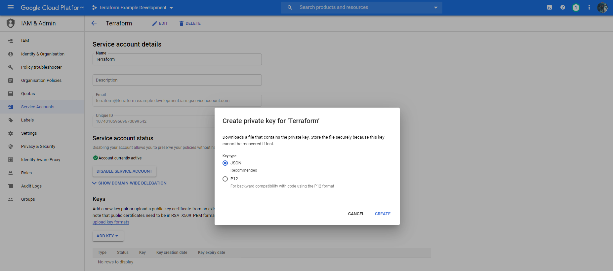

So, you've built your platform, you've got some lovely microservices, and now you'd like to deploy your infrastructure with [Terraform](https://terraform.io). Why do I even care about infrastructure as code, you ask? [A story will always explain it best.](https://medium.com/boltsource/wtf-is-terraform-afeafdd1fcf)

As an added bonus, you'd love for it to deploy to a development environment when code is pushed to the `develop` branch, and to production when pushed to `master`, as part of a [GitOps](https://www.weave.works/technologies/gitops/) approach.

Let's look at how we can do this, and keep our code [DRY](https://dzone.com/articles/software-design-principles-dry-and-kiss) with [Terragrunt](https://terragrunt.gruntwork.io/). We'll look at deploying the following:

* Google Cloud Project per environment
* [Google Kubernetes Engine (GKE)](https://cloud.google.com/kubernetes-engine)
* Docker images onto Google Kubernetes Engine
* A database provisioned by [Google Cloud SQL](https://cloud.google.com/sql)

We're also going to assume that we'd like to run our development environment in a cheaper (and therefore different) region, and with less nodes in our GKE cluster, so we need to be able to configure some of these parameters on a per-environment basis.

Let's get started. Exemplar code is available on [GitHub](https://github.com/Harjot1Singh/terraform-example).

## Prerequisites

Install the following to get started.

* [Docker](https://www.docker.com/)
* Google Cloud Platform account with *billing enabled*
* [Terraform](https://learn.hashicorp.com/terraform/getting-started/install.html)
* [Terragrunt](https://terragrunt.gruntwork.io/docs/getting-started/install/)
* Kubectl

Now, create two projects with [Google Console](https://console.cloud.google.com), named anything. One will be used for `development` deployments, and another, `production` deployments. Create a service account for each project, with `Editor` access. Once a service account is created, you can create a key for the service account (choose JSON), and download these. Keep them safe, we will need these.



#### CAVEAT

There is one more manual step involved - you must enable the [Cloud Resource API](https://console.developers.google.com/apis/library/cloudresourcemanager.googleapis.com) manually for your projects. I did try to define a Terraform step which automatically enables the correct permissions, however it ironically requires the Cloud Resource Manager API enabled first to do this. 

If anyone has a better suggestion, let me know in the comments!

## Structure

It's recommended to create a separate folder for all terraform/infrastructure needs at the root of your application. I will unsurprisingly designate this to be named `terraform`.

```bash
mkdir terraform
```

Now we're almost done! (No, do keep reading)

The remaining structure that this example uses is based off [Terragrunt's example](https://github.com/gruntwork-io/terragrunt-infrastructure-live-example) and [Jake Morisson's post](https://www.cogini.com/blog/deploying-complex-apps-to-aws-with-terraform-ansible-and-packer/).

We'll create two folders:

* **modules** - Isolated Terraform modules for repeatable instances of infrastructure: databases, services, load balancers.
* **live** - Terragrunt declarations of our actual infrastructure, leveraging the modules we define. Create folders to hold the declarations for any different environments inside:

  * **development**
  * **production**

The `development` and `production` folders will contain sub-directories corresponding to each unit of infrastructure. These folders will call upon any of our `modules` that we define.

An example: `live/production/gcp-gke` will provide the specific parameters required by `modules/gcp-gke`. This means that we can configure a different `live/development/gcp-gke` unit for our development environment, but only need to change the variables we pass. 

We will place `.hcl` files in the corresponding environment directories, which will contain environment-specific shared variables across the services. E.g. `live/development/env.hcl` will contain our development Google Account details.

Now we're DRY-ing ✔.

### What does Terragrunt do for us?

A lot of the original USPs that Terragrunt boasts are slowly making their way into Terraform. But that still leaves a few worthwhile reasons to pick it up.

Terragrunt can read and include these files, so that we can keep them in one place. We can now include other `.hcl` files with the `include` block and cleanly represent dependencies with the `dependency` block. More information on the extensions that Terragrunt provides is available via the [Terragrunt Docs](https://terragrunt.gruntwork.io/docs/getting-started/configuration/).

When we run `terragrunt apply-all`, it will find all `terragrunt.hcl` files in all sub-folders and execute them. So, to deploy production infrastructure, all we now need to do is `cd production && terragrunt apply-all`. Can you do this with Terraform, you ask? Well, yes, by defining various variable files and supplying CLI arguments. This approach becomes cumbersome on a day-to-day basis. This [Reddit post](https://www.reddit.com/r/Terraform/comments/hv9gdl/when_is_terragrunt_needed/) provides a good example of this.

## Enough talk, show me the money!

So far, we have:

```bash
- terraform/
  - live/
    - development/
    - production/
  - modules/
```

We are going to work towards ending up with:

```bash
- terraform/
  - live/ <= Our actual infrastructure
    - common.hcl <= Common variables that apply across environments
    - terragrunt.hcl <= Common parameterised, declarations for state storage etc, used by children files
    - development/
      - credentials.json <= Development Project's Google Service Account credentials
      - env.hcl <= Variables for development environment
      - gcp-gke/
        - terragrunt.hcl <= Includes env files and supplies values to corresponding module
      - gcp-sql/
        - terragrunt.hcl
    - production/
      - credentials.json <= Production Project's Google Service Account credentials
      - env.hcl  <= Variables for production environment
      - gcp-gke/
        - terragrunt.hcl
      - gcp-sql/
        - terragrunt.hcl
  - modules/ <= Reused by live/
    - gcp-gke/
      - main.tf <= Declarations
      - variables.tf <= Module's input variables
      - output.tf <= Module's output variables
    - gcp-sql/
      - main.tf
      - variables.tf
      - output.tf
```
Go ahead and create these directories.

Although you may see a duplication of structure, do remember that `modules/gcp-gke` specifies how to create a Google Kubernetes Cluster, whilst `development/gcp-gke` will leverage `modules/gcp-gke` to create a Google Kubernetes Cluster for the development environment with the supplied configuration.

### Service Account Credentials

For now, place the two service accounts that you created earlier into the corresponding directories. You should *never* commit these to a repository. Instead, the contents should be supplied as an environment variable by CI and written to disk during the execution of pipeline, or a secrets manager should decode the files during the pipeline run.

### *common.hcl:* Cross-environment shared variables

This file will contain variables that we want to share across all our environments. Currently, this will include simply the organisation name, which will be used elsewhere.

```
# terraform/live/common.hcl

locals {
  # Global organisation identifier
  org = "terraform-rabit-ocean"
}

```

The `locals` block is [Terraform syntax](https://www.terraform.io/docs/configuration/locals.html) defines variables that can be used elsewhere within the file.

### *terragrunt.hcl:* Root Terragrunt file
`terraform/live/terragrunt.hcl` will contain the common elements that we'd like to merge with our actual infrastructure declaration files.

Let's start by reading in any variables we might need.

```terraform
locals {
  # Load any configured variables
  env    = read_terragrunt_config(find_in_parent_folders("env.hcl")).locals
  common = read_terragrunt_config(find_in_parent_folders("common.hcl")).locals
}
```

You may have noticed that we haven't defined `env.hcl` yet. This is because it'll reside in each environment's directory (`terraform/live/production` or `development`). 

`find_in_parent_folders("env.hcl")` may not make sense in this context, but if you remember that the root `terragrunt.hcl` file will be included by other files, then this now makes sense.

It's time to configure remote state. Terraform needs to store the state of the infrastructure somewhere. It can be done within your Git repository, but it's highly recommended to use remote storage. In our case, we will use a Google Cloud Storage bucket for this:

```terraform
# Configure Terragrunt to store state in GCP buckets
remote_state {
  backend = "gcs"

  config = {
    bucket      = join("-", [local.common.org, local.env.env, "--terraform-state"])
    prefix      = "${path_relative_to_include()}"
    credentials = local.env.credentials_path
    location    = local.env.region
    project     = local.env.project
  }

  generate = {
    path      = "backend.tf"
    if_exists = "overwrite_terragrunt"
  }
}
```

This instructs Terragrunt to generate a `backend.tf` file with all modules. To show you the output from the Terragrunt cache:

```terragrunt
# Terragrunt cache output: backend.tf
# Generated by Terragrunt. Sig: nIlQXj57tbuaRZEa
terraform {
  backend "gcs" {
    credentials = "D:/Projects/terraform-example/terraform/live/development/credentials.json"
    prefix      = "development/gcp-gke"
    bucket      = "terraform-rabit-ocean-development---terraform-state"
  }
}
```

Our modules will require a Provider, [which is responsible for understanding interactions and exposing resources](https://www.terraform.io/docs/providers/index.html). Now, let's add a common provider configuration for Google Cloud Platform:

```terraform
generate "provider" {
  path      = "provider.tf"
  if_exists = "overwrite_terragrunt"
  contents  = <<EOF
    provider "google" {
      version = "~> 3.16.0"

      credentials = local.env.credentials
      project     = local.env.project
      region      = local.env.region
    }
  EOF
}

```

All configuration options are available on the [Google Cloud Platform Provider documentation page](https://www.terraform.io/docs/providers/google/index.html). Like `backend.tf`, Terragrunt will generate `provider.tf` and place this in the folder of any module that includes the root `terragrunt.hcl`.

Finally, we'll configure some convenience inputs that will be merged with and available to any other Terragrunt modules that include this file:

```terragrunt
inputs = merge(
  local.env,
  local.common,
)
```

We're now done with defining our reusable `terraform/live/terragrunt.hcl` file.

### *env.hcl:* Environment-specific variables

We'll define two files:
- `terraform/live/production/env.hcl`
- `terraform/live/development/env.hcl`

This will allow us to satisfy one of our earlier requirements of different configurations and regions per environment.

Add the following to each file and change the project to match the project listed inside `credentials.json`.

```terraform
locals {
  env = "development"

  region = "us-east1"

  credentials_path  = "${get_terragrunt_dir()}/credentials.json"
  credentials       = jsondecode(file(credentials_path))

  service_account  = local.credentials.client_email
  project         = local.credentials.project_id
}

```

Note how the project ID and service account email address are extracted from the credentials, for our own convenience.

### Defining Modules

We've defined some reusable configuration in the `live` directory, but now it's time to actually define the Terraform modules that will be doing the work, inside `terraform/modules`.

Let's start with Google Kubernetes Engine. We'll make use of the [Google's GKE module](https://registry.terraform.io/modules/terraform-google-modules/kubernetes-engine/google/10.0.0).

Create `terraform/modules/gcp-gke/main.tf`:

```

```


