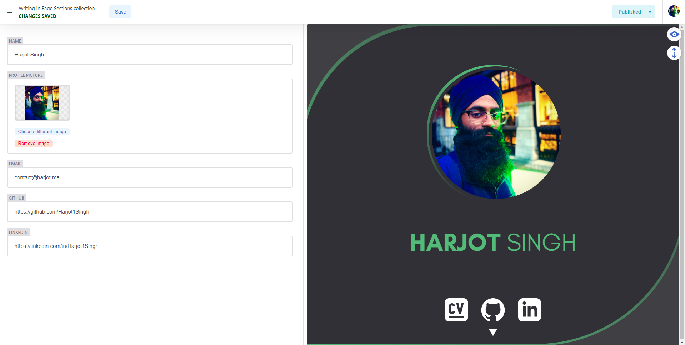
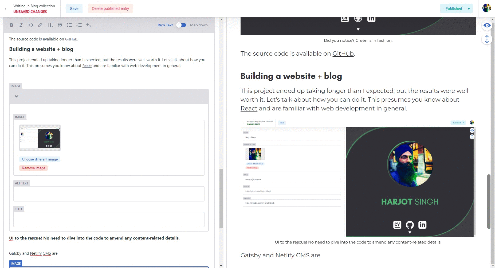
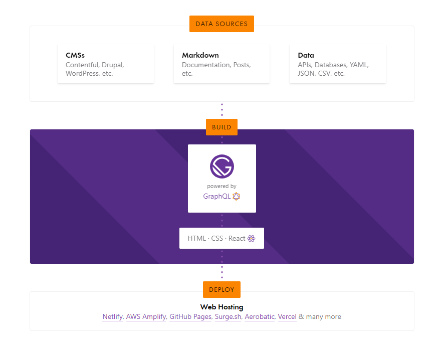

## Out with the [old](http://web.archive.org/web/20180831111543/https://harjot.me/), in with the new.

> The significant problems we face cannot be solved by the same level of thinking that created them - *Albert Einstein*

I've had a [website](http://web.archive.org/web/20180831111543/https://harjot.me/) for a couple of years now. Since 2017, in fact. But it was time for a change, with something that reflected my growth over the past few years.

Take a look at the difference, and decide for yourself.

### 2017

As a trusty companion for many years, this site had **served** me well (laughing is mandatory), but updating the content was a huge pain point, with no separation between content and code.

I've learnt better now, and I'll talk about how [Netlify CMS](https://www.netlifycms.org/) has solved this for me.


### 2020

Throughout my years as of product design & development, I've learnt to place an emphasis on **readability & usability.** In practice, this means looking at spacing, font sizes, and colour contrast, and spending some time **planning & prototyping** before steaming ahead. I cannot recommend [Figma](https://figma.com) enough for this. If you do not wish to prototype all the details, it is still worth starting with one view and setting a consistent design language.


The source code is available on [GitHub](https://github.com/Harjot1Singh/harjot.me).

### Building a website + blog

This project ended up taking longer than I expected, but the results were well worth it. Let's talk about how I did it. This presumes you know about [React](https://reactjs.org) and are familiar with web development in general.

I ended up with the ability to edit content with a UI provided by Netlify CMS, a blog, and any other static pages with configurable content. My site also has a [projects](https://harjot.me/projects) section, which shares largely the same implementation powering this blog.

Gatsby is huge help in building a blazing-fast static website, which will have all the content pre-built and ready to consume. Compare this to platforms like [Wordpress](https://wordpress.org), where the content of each page must be fetched and rendered on request (your users' patience will wear thin). 

This is one of the things that the great [Gatsby](https://gatsbyjs.org) will provide us, being a wonderful static site generator. On a side note, do read the [novel.](https://en.wikipedia.org/wiki/The_Great_Gatsby)



###### UI to the rescue! No need to dive into the code to amend any content-related details.

#### What is [Netlify CMS](https://netlifycms.org)?

From their website: ***Open source content management for your Git workflow.***

Let's unpack it a little. Traditionally, a content management system like Wordpress would rely heavily on a backend and database to fetch and render the requested pages on demand. This process is very disconnected from the modern day developer's expectations of environment and tooling, making it frustrating to customise the visuals of the blog and add additional functionality. 

Then began the rise of many [headless CMS](https://headlesscms.org/) tools, which provided the user interfaces and mechanisms for managing content, but still allowing the same flexibility of building a UI from scratch.

There are many to choose from, but Netlify CMS makes use of Git in an exciting way - to use Git as a backend! Git is great at version control, and this appears to be a great fit for blog post reviews, revisions, and fixed content. We've done this with [Shabad OS database](https://github.com/ShabadOS/Database) for a long time, so it's amazing to see that this technique is also leveraged in other places. Netlify CMS sources the data for the UI from any Git backend (I'm using GitHub), and will put in pull requests and handle merging through the Netlify CMS UI, integrated directly into your site.

The UI allows you to integrate a custom preview, which will render your React pages live with the content included.

Take a look at me writing this blog post, with the live editing!



###### A pleasant editing experience with live preview.

The content is saved as separate markdown files with inline YAML:

```yaml
---
templateKey: about-section
skills:
  - JavaScript
  - Node
  - CSS
---
I **design** and **develop** products passionately.

**Get in touch.**
```

#### What is [Gatsby?](https://gatsbyjs.org)

Gatsby is a static site generator. This means that it fetches all of your content at build-time, and builds your React app with the content supplied. The diagram from [gatsbyjs.org](https://gatsbyjs.org) provides a better explanation.



To retrieve data, Gatsby is powered by GraphQL, which does take a little to get your head around initially. Effectively, it is used as a querying layer to retrieve content, images, and apply transformations to any data. The Gatsby builder will replace GraphQL references under the hood with the results of the query, so that all the pages of content can be pre-built and consumed by users without having to fetch the data again.

Gatsby will build your React app with optimised images, code-splitting, routing, and many more features out of the box.

#### I'd like to have a go.

I forked [gatsby-starter-netlify-cms](https://github.com/netlify-templates/gatsby-starter-netlify-cms), but admittedly changed a fair amount of boilerplate and structure.

The process approximately is:

* Initialise the template repository
* Create all page components as you please, but instead supply the props for the data that the CMS will provide
* Write the relevant GraphQL queries and supply them to the page components
* Link up the Netlify CMS pages to the page components (which are not wrapped with GraphQL)
* Create some initial content with Netlify CMS' UI
* Publish it all with [Netlify](https://netlify.com) (recommended) or GitHub pages

If anyone would like a more in-depth write up, let me know in the comments!

### Writing = Thinking

This is my first blog post, and hopefully, not my last. Let's see where this goes.

Perhaps it's time to improve my writing skills. This blog seems like the perfect place to do this.