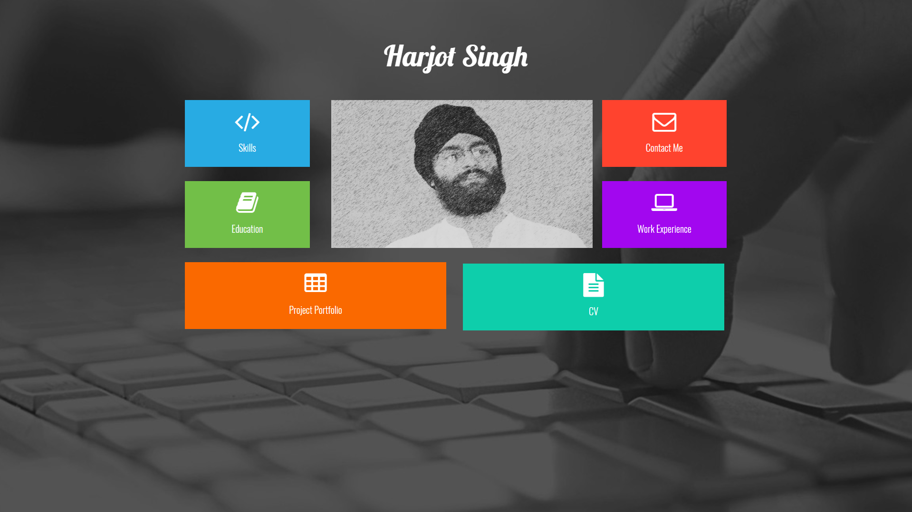
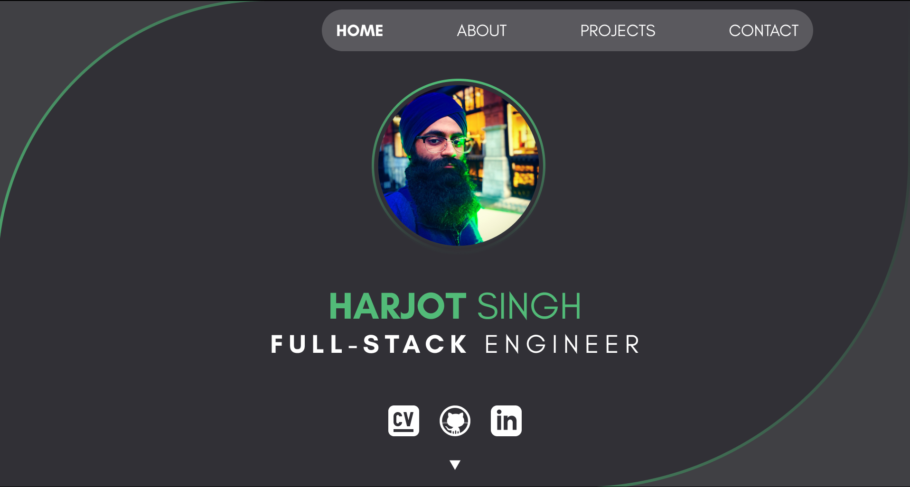

## Out with the [old](http://web.archive.org/web/20180831111543/https://harjot.me/), in with the new.

I've had a [website](http://web.archive.org/web/20180831111543/https://harjot.me/) for a couple of years now. Since 2017, in fact. But it was time for a change, with something that reflected my growth over the past few years. 

Take a look at the difference, and decide for yourself.

## 2017

*That background image... the shame.*

## 2020

*Did you notice? I like green.*

### Writing = Thinking

Perhaps it's time to improve my writing skills. This blog seems like the perfect place to do this.