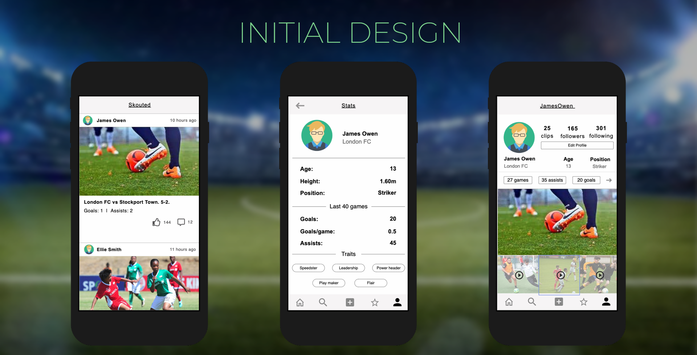
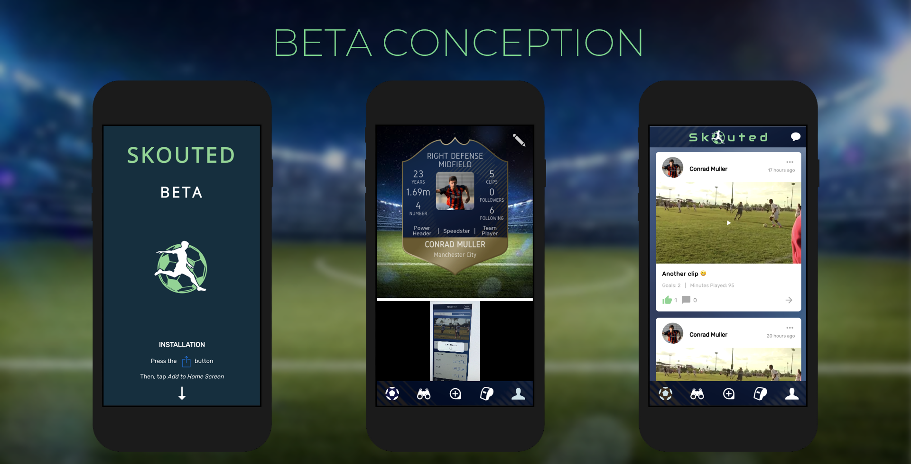
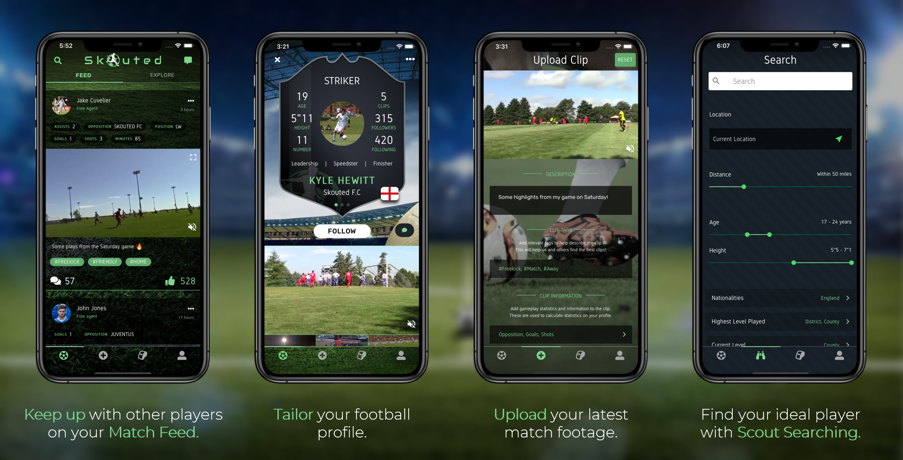

**Links:**

* [Website](https://skouted.co.uk)
* [App Store](https://apps.apple.com/gb/app/skouted/id1474856907)
* [Google Play Store](https://play.google.com/store/apps/details?id=uk.co.skouted.app)

## Motivation

In the football industry, there are a lot of **talented** **players that get overlooked** by the current scouting system.

The reason they go by **unnoticed** is because there isn’t currently a solid **platform** for players from **grassroots level** **upwards.**

## Solution

[Skouted](https://skouted.co.uk) is a **social network** for all **footballers,** from **grassroots** level to **professional** clubs.

Our [iOS](https://apps.apple.com/gb/app/skouted/id1474856907) and [Android](https://play.google.com/store/apps/details?id=uk.co.skouted.app) **app** provides players the best possible chance of being **noticed** by both **scouts and clubs.**

This platform was undertaken initially as the subject of my Master's Thesis at the University of Warwick, where I led a group of 5. I continued work on the project beyond the thesis, amounting to 1.5 years of full-time development of new features. The full thesis paper can be downloaded at the end of this post.

### Features

#### Players

* Register with name, age, attributes
* Upload footage clips and statistics
* Guardian-managed accounts for U16 players

#### Scouts

* Search for players with filters
* Follow and assess players of interest
* Message players

#### Five-a-side

* Create and manage 5/6/7/8/9/11-a-side teams on the app, and invite other users to join your squad.
* Schedule matches between other nearby 5-a-side teams within the app

## Design Iterations

### Initial Conception

The initial mockups and prototyping focused on capturing and including relevant data, heavily inspired by existing social networks. Although rudimentary, it gave us an opportunity to visually assess missed data and aspects to a fully-featured app, as well as highlight some UX pain-points early on.

### Logo Concept

The logo was designed to have a standalone, identifiable graphic as the centrepiece, particularly as the app format requires a distinct icon for users. The full text logo and tagline emphasises uplifting energy and hope, the idea being that this would encourage users who are at all levels of their footballing journey.

### Beta Test

We piloted the app with a small number of users, having completed all the MVP features required of any social network: liking, commenting, messaging, profiles, uploading, and notifications. The app began to shape up more uniquely, despite the further work required on design. This was a great chance to evaluate what features and UX patterns worked well, and what needed changing before our launch.

### Launch

By the time we got to the launch phase, the app had undergone a huge redesign, embracing stunning visuals and consistent branding throughout.

## **Technology**